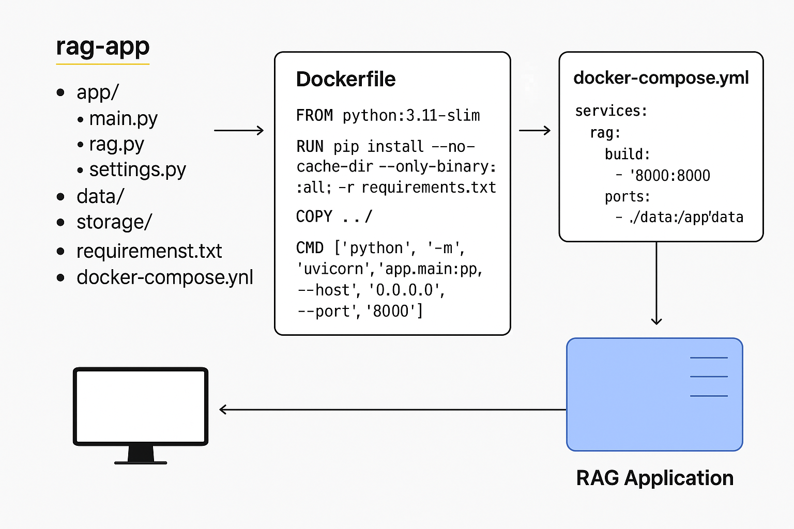

# RAG-Application – Retrieval-Augmented Generation
This project demonstrates a Retrieval-Augmented Generation (RAG) pipeline built with FastAPI, ChromaDB, and OpenAI/Ollama LLMs, fully containerized using Docker and Docker Compose.

Features:
- Data ingestion: Load .txt or .md documents into a local vector database.
- Vector search: Retrieve top-k relevant chunks using ChromaDB and Sentence Transformers embeddings.
- LLM generation: Query OpenAI or Ollama models with retrieved context for accurate, cited answers.
- Containerization: Reproducible builds via Docker, easy orchestration with Docker Compose.

Endpoints:
- POST /ingest → Index documents.
- POST /query → Ask questions with context-based answers.
- 

